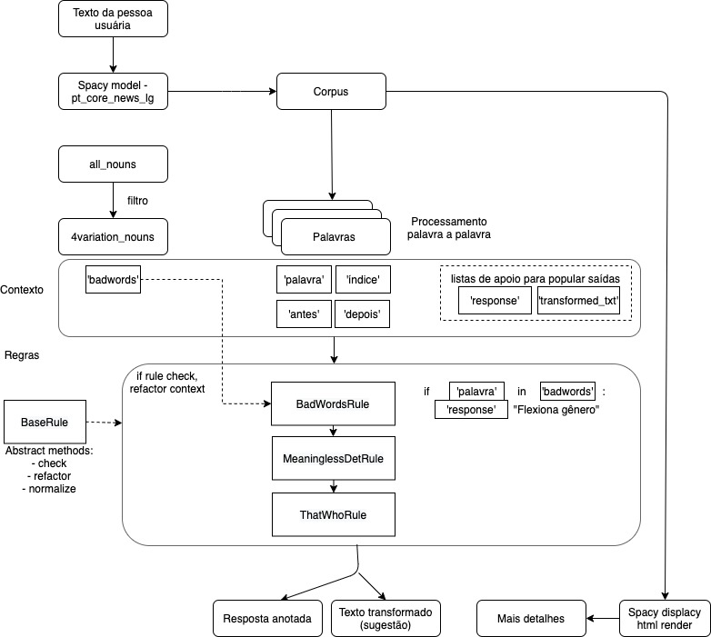

# LI²A: Linguagem Inclusiva com Inteligência Artificial

Ferramenta de linguagem inclusiva em Português

## Dados
all_nouns.csv:
  Palavras que são flexionadas por gênero (4 variações). Inclui a coluna 'meaning' com o significado de dicionário de cada palavra do arquivo.

4plus_variation_nouns.csv:
  Subset de all_nouns com palavras que são flexionadas por gênero (4+ variações).

## Streamlit
Para rodar o Streamlit, primeiro instale as libs abaixo:
- streamlit
- st-annotated-text

Depois no terminal vá a pasta raiz do repositório e rode o comando `streamlit run app.py`

## Fluxo da Aplicação

  

[Link do arquivo .drawio para editar o fluxo](https://drive.google.com/file/d/16eAe_DxUXD3WKhiTgltBbe9OE9i-_I7K/view?usp=sharing)
